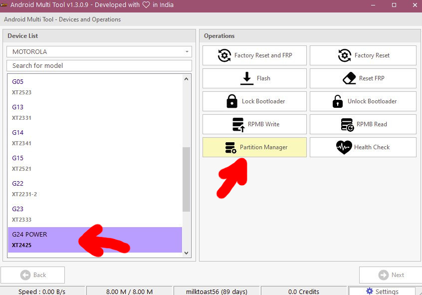
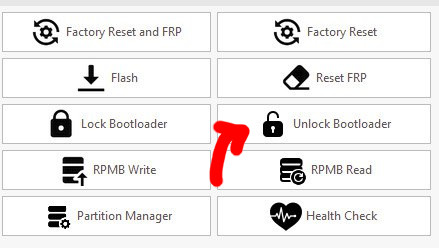

:::info 
**[Updated 24.02.2025]** 

A way to unlock bootloader via a paid tool has been found
:::

## Unlock bootloader
:::warning
**Never flash the stock bootloader (lk) as it will automatically lock the bootloader.**

This may turn the device into a “brick”, especially if modifications have been made previously.
:::

### Paid method
For this method you need an [AMT Tool](https://androidmultitool.com/) license in order to utilize the engineering DA they have stored on the servers.

I recommend you rent it from someone for an hour

1. Download the latest pre-built version of [Custom Bootloader (ChouChou)](../modding/custom-bootloader) that matches your firmware version.
2. Open the AMT tool and **flash the ChouChou** to save the unlocked bootloader state after unlocking it

   
   
   
   

3. Open the AMT tool and click the **“Unlock bootloader”** button

   

## Archive (Old information)

### Official way

The official way to unlock the bootloader does not work on Moto g24, as the `fastboot oem unlock` command does not exist.
It's possible to use `fastboot flashing unlock` command only to get greeted by the `[secure] not allow` message.

Through the reverse engineering of the bootloader, we were able to conclude that the phone does not require any key (compared to [penangf](https://penangf.fuckyoumoto.xyz/docs/dev/oem-key-algorithm)).
Instead, it only requires secure boot to be disabled, and the bootloader will get unlocked.

The phone seem to have a modified version of lk, developed by `Tinno`. This bootloader has a feature to relock right away if the phone is not a development unit, making it mandatory to develop a patched LK in case of success in unlocking the bootloader.

### mtkclient

MTKClient didn't work at first with moto g24, as the Download Agent had DA SLA enabled with Tinno keys.
Thanks to [Shomy](https://github.com/shomykohai), the keys needed for one of the two DA files of g24 was found and merged into mtkclient (git, not stable release).

Trying to unlock the bootloader with mtkclient, get us the same error there was on moto g23:

```sh

...
XFlashExt - [LIB]: Unsupported ctrl code
...
```

We were able to figure out the issue to come from the fact that mtkclient tries to get the seccfg partition through the partition list, which in this case is not possible.

So, the alternative way was dumping seccfg with offsets and try to write it back:

```sh
$ mtk ro 0x12000000 0x800000 seccfg,bin --loader DA_SWSEC_2316_p325a_dl_forbidden3.bin

...
Progress: |██████████| 100.0% Read (0x4000/0x4000, ) 7.26 MB/s0 MB/s
Dumped offset 0x12000000 with length 0x800000 as seccfg,bin.

$ mtk wo 0x12000000 0x800000 seccfg,bin

...
DaHandler - Writing offset 0x12000000 with length 0x800000
DAXFlash
DAXFlash - [LIB]: Error on sending parameter: Write data not allowed (0xc002000c)
Failed to write seccfg,bin to offset 0x12000000 with length 0x800000.
```

We are still investigating the possibility of using `DA_SWSEC_2316_p325a.bin`, which is blocked by another pair of DA SLA keys.


### Contribute

If you want to contribute to the research, write a post in the [github discussion](https://github.com/orgs/moto-fogorow/discussions/1)

